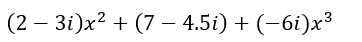

# DSA-Big-HW1

This is the first big assignment in the data structures course (in C++). In the following, the solutions will be explained.

## Exercise One

### Solution Description

1. We generate a matrix containing the information about the interactions between attendees at the party, with the help of vectors, we read the rows of the matrix from a given text file and save them. Of course, we first read the maximum size of the matrix from the first line of the text file. 

2. We create a stack in which we push the indices corresponding to each person present at the party; from 0 to N-1 (N being the size of  the matrix).

3. We repeatedly check if the people corresponding to the last 2 indices in the stack have talked to each other or not: 
	
- Case A: None of them talked to the other, both are removed from	the stack.  

- Case B: Both talked to each other, both are removed from the stack.

- Case C: Only one of them talked to the other, we remove the one who talked from the stack.


4. Using the characteristics of our VIP “Homer”, we eliminate all the incompatible candidates, leaving only Homer in our stack, or if there’s no one left in the stack, this means that Homer simply wasn’t present at the party.

5. Once we find a candidate, we determine if he hasn’t talked to anyone by checking his row in the matrix and if everyone has talked to him by checking the column corresponding to his index in the matrix.

### How to Use

Create a text file, add on the first line the size of your matrix 		[one integer], on the following lines you write the rows of the matrix,		whose elements are separated by commas. (See the m1.txt file as an		example)
After running the program, you will be asked to insert a path to a text file containing a matrix, then you will simply receive an answer, either that the VIP wasn’t present or the id of the VIP if they attended the party.


## Exercise Two

### Solution Description

1. Our abstract “restaurant” can take orders from text files which are stored using a structure called “order”, having the fields (t) and (d) meaning arrival time and duration. 

2. It can display the expected and actual time of completion for an order, it can also display a message when the chef can take a break and whether any order will be completed after the closing time.

### How to Use

When running the program, you will be asked to insert a path to a text file from which the orders will be read, the text file should respect this format: 

```
Line 1: NUMBER OF ORDERS [INT], CLOSING TIME [INT]
Line 2: TIME_OF_ARRIVAL [INT] , DURATION [INT] 
Line 3: REPEAT FORMAT OF LINE 2 
```

## Exercise Three

1. With the help of linked lists, this program can create polynomials with complex coefficients, it can compute the value of polynomials for a given complex number,
it can sum and multiply polynomials of different degrees, it can read polynomials from text files. If the exponent of a certain term is higher than the degree of the polynomial, it is going to be ignored and if a line is empty, it will also be ignored. 
After reading a text file, if the program can’t find any proper terms to generate the polynomial, then it will add a default term with the exponent equal to its maximum degree and the coefficient (1).

2. The polynomial class contains a method called “simplify” which is used to sum all the terms of the polynomial having the same exponent after reading or summing or multiplying polynomials.

3. A structure called “pTerm” is used to store monomials as objects having the fields: exponent(int) and “coeff” ( complex coefficient) and for working with complex numbers, another class called “complex” is used.

4. To sum/multiply the terms of polynomials, this program uses a method from the “pTerm” structure called “sum/mult” which returns a new “pTerm”.

5. The same polynomial object can be changed by reading more than one file. For example, if a polynomial “p1” was created and the program was told to read the monomials from the file “p1.txt”, we can make it read that same file again for the same polynomial instance and the older terms of the polynomial would be summed up with the newly added ones. If we make it read a different file “p2.txt” for the same polynomial instance, it will check whether the newly read degree is different from the old one. If it’s smaller, all the old terms with an exponent higher than the new degree will be removed, then the new terms will be added, and the degree will be changed to the smaller one.

### How to Use

There are two ways to use this program, but first you must prepare the text files in which you will provide information about the polynomials you would like the program to generate and work with. 

- By just running the program, you can directly tell it through the console what operations you want it to perform (summation, multiplication, computing values of polynomials or just displaying one, then specify the path of the text file.

- Alternatively, you can remove the while loop inside main and manually call the following methods for different polynomials: p1.readPolynomial(PATH), p1.display(), p1.sum(Polynomial p2), p1.mult(Polynomial p2) 

For example, if we wanted to generate this polynomial:



```
Inside the text file: 
Line 1: 3 //The Degree of the polynomial [int]. (It can be higher than 3 too).
Line 2: 2, 2, -3 // exponent of monomial [int], real part of coefficient [double], imaginary part [double].
Line 3: 0, 7, -4.5
Line 4: 3, 0, -6
```


